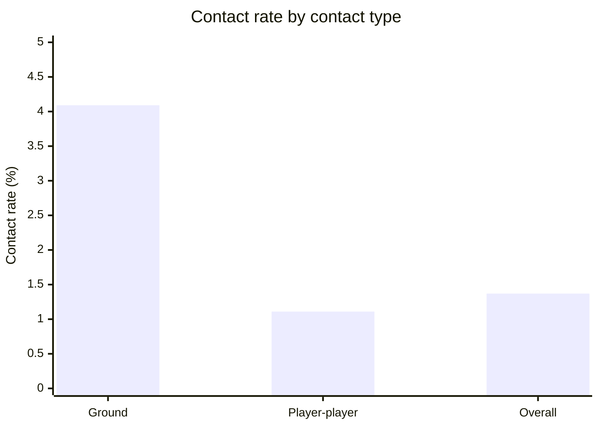
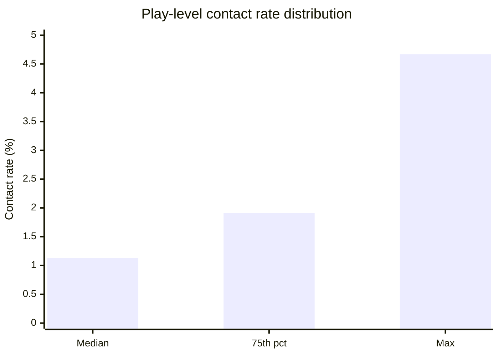
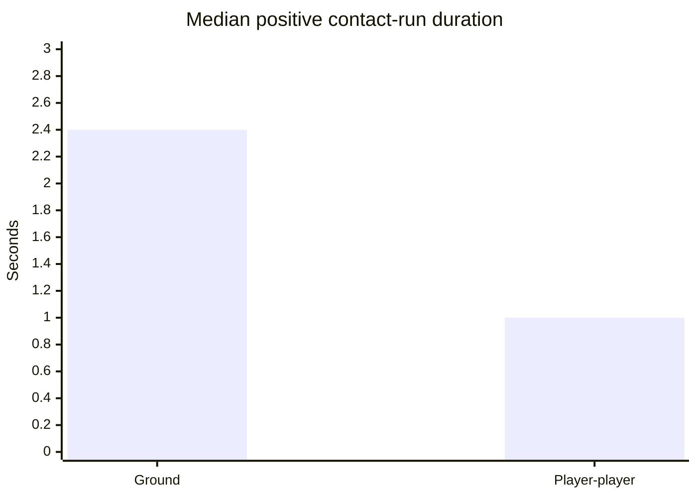
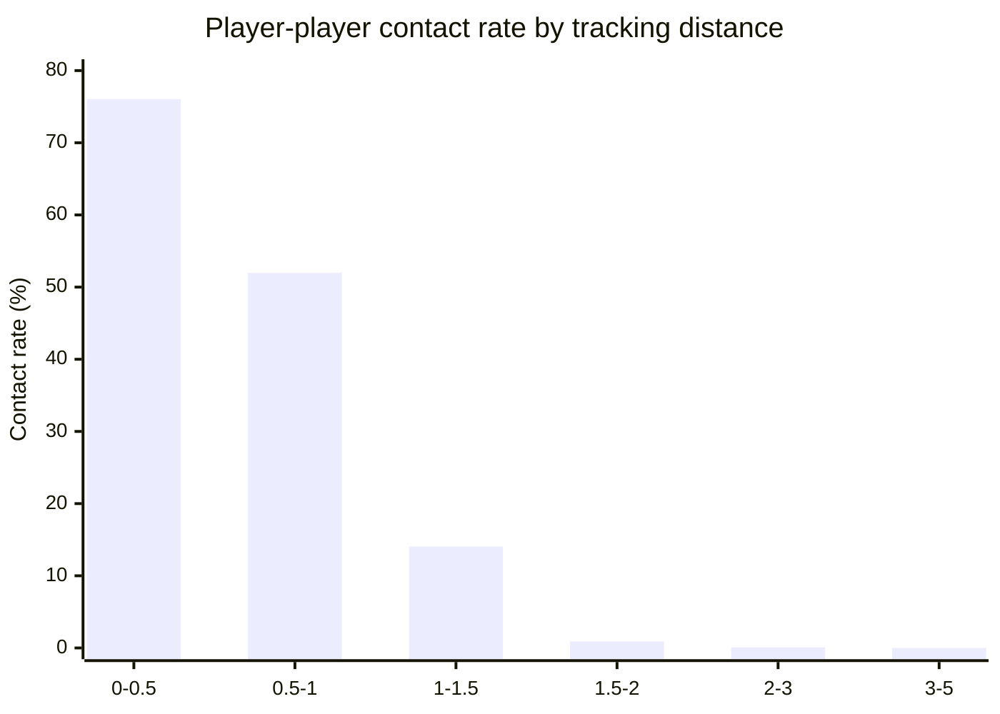
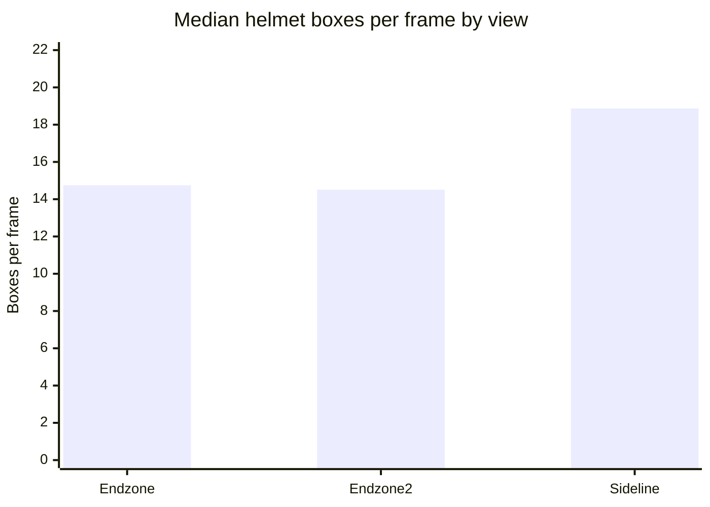
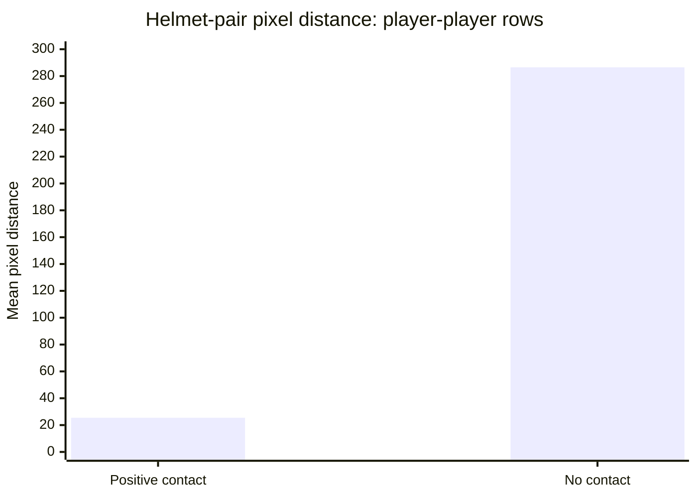
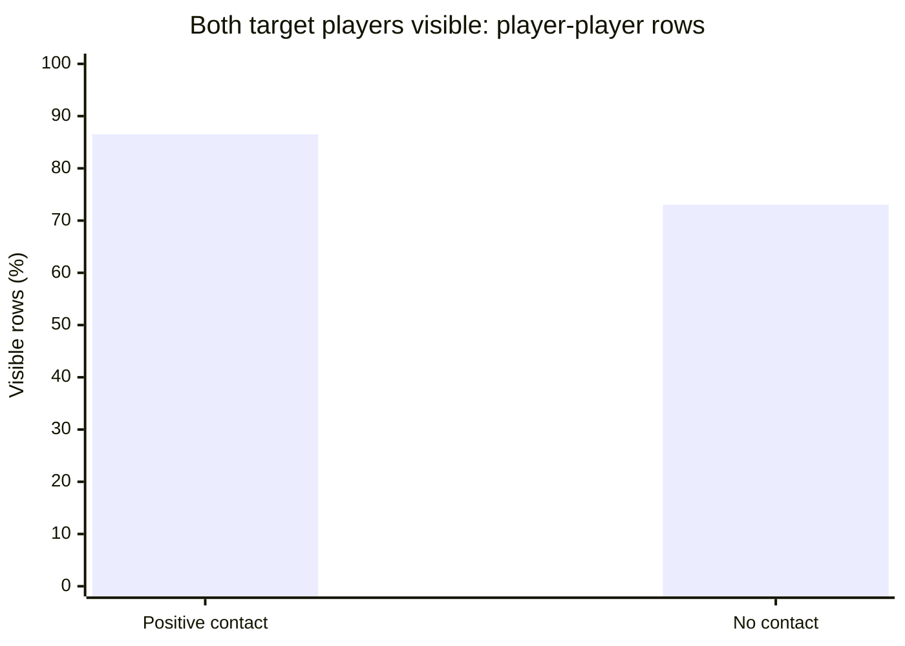

# EDA Insights

## 1. Purpose

[`1_eda_contact_tracking_video_context.ipynb`](../notebooks/1_eda_contact_tracking_video_context.ipynb)
is the project EDA notebook. Its job is to explain the data, show contact
behavior, reveal failure modes, and identify feature ideas. Model rankings,
leaderboard scores, and champion decisions live in
[`3_model_evaluation_progress.md`](3_model_evaluation_progress.md).

The current EDA run is:

| Notebook | Version |
| --- | --- |
| `1_eda_contact_tracking_video_context.ipynb` | `EDA_V10_VIDEO_DEMO` |
| `8_yolo_video_feature_probe.ipynb` | `YOLO_VIDEO_PROBE_V4_NETCHECK` |

## 2. Dataset Scale

The EDA run loaded all expected competition files from the canonical Kaggle
path:

```text
/kaggle/input/competitions/nfl-player-contact-detection
```

| Dataset | Rows | Columns | EDA Meaning |
| --- | ---: | ---: | --- |
| `train_labels.csv` | 4,721,618 | 9 | Main 10 Hz contact labels after parsing IDs. |
| `sample_submission.csv` | 49,588 | 8 | Public mock test rows and submission schema. |
| `train_player_tracking.csv` | 1,353,053 | 17 | 10 Hz player tracking features. |
| `test_player_tracking.csv` | 14,872 | 17 | Public mock test tracking rows. |
| `train_baseline_helmets.csv` | 3,783,616 | 12 | Baseline helmet boxes and player assignments. |
| `test_baseline_helmets.csv` | 47,330 | 12 | Public mock test helmet boxes. |
| `train_video_metadata.csv` | 480 | 7 | Sideline and Endzone timing metadata. |
| `test_video_metadata.csv` | 4 | 7 | Public mock test video metadata. |

There are `240` labeled training plays. A typical play has `22` players and
`253` contact candidates per step: `231` player-player pairs plus `22` player
ground rows.

## 3. Data Quality

The core tables are clean enough for modeling:

| Check | Result |
| --- | ---: |
| Duplicated label rows | 0 |
| Duplicated `contact_id` values | 0 |
| Label `game_play` count | 240 |
| Train tracking `game_play` count | 240 |
| Sample duplicated `contact_id` values | 0 |
| Train/test tracking shared columns | 17 |
| Train/test helmet shared columns | 12 |

The earlier EDA issue around video metadata is fixed. The metadata tables hold
timing fields such as `start_time`, `end_time`, and `snap_time`; video
filenames are in the helmet files. EDA now summarizes timing metadata and
helmet filenames separately.

## 4. Target Balance

The overall contact rate is only `1.37%`, so the task is extremely imbalanced.
Accuracy is not a useful metric for understanding or modeling this data.

| Contact Type | Rows | Contact Rate | Positive Rows |
| --- | ---: | ---: | ---: |
| Ground | 410,633 | 4.09% | 16,814 |
| Player-player | 4,310,985 | 1.11% | 47,708 |

EDA interpretation:

- Ground rows are much less common than player-player rows, but their positive
  rate is almost four times higher.
- Player-player rows dominate the dataset volume, so global metrics can hide
  weak ground-contact behavior.
- Any useful EDA or validation report should split ground and player-player
  contact.

Markdown chart mirroring the notebook target-balance plot:



## 5. Play-Level Variation

Contact rate varies substantially by play:

| Play-Level Statistic | Median | 75th Percentile | Max |
| --- | ---: | ---: | ---: |
| Rows per play | 18,975 | 21,758 | 43,769 |
| Positive contacts per play | 235.5 | 363.0 | 750.0 |
| Contact rate | 1.13% | 1.91% | 4.67% |
| Play duration | 7.5 sec | 8.6 sec | 17.3 sec |

EDA interpretation:

- Some plays are contact-heavy, while others have no positive labels.
- Validation must group by play because rows from the same play are highly
  correlated.
- Long plays create more repeated no-contact rows and can distort threshold
  tuning if not grouped properly.

Markdown chart from the play-level EDA summary:



## 6. Temporal Contact Runs

Positive labels appear in contiguous runs rather than isolated single rows:

| Contact Type | Positive Runs | Mean Duration | Median Duration | Max Duration |
| --- | ---: | ---: | ---: | ---: |
| Ground | 676 | 2.49 sec | 2.4 sec | 10.6 sec |
| Player-player | 3,505 | 1.36 sec | 1.0 sec | 7.2 sec |

EDA interpretation:

- Contact is temporal. A single frame or single 10 Hz row is too narrow to
  describe the event.
- Ground-contact runs are longer than player-player runs, which supports using
  separate analysis and smoothing behavior by contact type.
- The long tail of run durations may include sustained tackles, pileups, or
  label noise. These cases deserve video inspection.

Markdown chart summarizing the positive-run duration plot:



Recommended deep dive:

1. Add a tracking animation for one long ground-contact run.
2. Overlay active contact pairs across neighboring steps.
3. Compare `t-3` through `t+3` motion windows for true contact starts versus
   non-contact rows.

## 7. Tracking Context

Tracking data covers pre-snap and post-snap context. The global tracking
summary includes negative steps, with `step` ranging from `-339` to `692`.
Labels use play-relative steps starting at `0`, while tracking contains broader
context around the play.

Key tracking ranges:

| Feature | Median | 75th Percentile | Max |
| --- | ---: | ---: | ---: |
| Speed | 0.65 yd/s | 1.62 yd/s | 14.89 yd/s |
| Distance traveled | 0.07 yd | 0.16 yd | 2.22 yd |
| Acceleration | 0.47 yd/s^2 | 1.04 yd/s^2 | 33.55 yd/s^2 |
| Signed acceleration `sa` | -0.03 | 0.16 | 33.55 |

EDA interpretation:

- Most player steps are slow or near stationary, but contact-relevant rows can
  involve sharp acceleration changes.
- The wide tracking window is useful for context, but feature generation must
  align labels to step-relative play rows carefully.

## 8. Ground-Contact Motion

For ground rows joined to player tracking:

| Contact | Mean Speed | Median Speed | Mean Distance | Mean Acceleration | Mean `sa` |
| ---: | ---: | ---: | ---: | ---: | ---: |
| 0 | 2.73 | 2.08 | 0.276 | 1.62 | -0.114 |
| 1 | 0.92 | 0.58 | 0.096 | 1.44 | -0.653 |

EDA interpretation:

- Ground-contact positives are slower on average than ground non-contact rows.
- Positive ground rows have more negative signed acceleration, consistent with
  players slowing down, being tackled, or going to ground.
- Ground-contact detection should emphasize deceleration, speed collapse, and
  short-window motion changes rather than only high acceleration.

Markdown chart from the ground-contact motion slice:

```mermaid
xychart-beta
  title "Ground-contact motion: contact vs non-contact"
  x-axis ["Speed", "Distance", "Acceleration", "Signed accel"]
  y-axis "Mean value" -1 --> 3
  bar [0.92, 0.10, 1.44, -0.65]
  bar [2.73, 0.28, 1.62, -0.11]
```



The first bar series is positive ground contact. The second bar series is
ground non-contact.

Recommended deep dive:

1. Compute speed and `sa` deltas from `t-3` through `t+3`.
2. Detect sudden speed drops before long ground-contact runs.
3. Split ground-contact motion by position because linemen, backs, and
   receivers likely have different motion signatures.

## 9. Player-Player Distance

Distance is the strongest simple EDA signal for player-player contact:

| Distance Bin | Rows | Positives | Contact Rate |
| --- | ---: | ---: | ---: |
| 0.0-0.5 yd | 547 | 416 | 76.05% |
| 0.5-1.0 yd | 6,381 | 3,316 | 51.97% |
| 1.0-1.5 yd | 9,659 | 1,357 | 14.05% |
| 1.5-2.0 yd | 11,464 | 104 | 0.91% |
| 2.0-3.0 yd | 26,052 | 22 | 0.08% |
| 3.0-5.0 yd | 58,756 | 2 | 0.003% |
| 5.0-10.0 yd | 122,505 | 0 | 0.00% |
| 10.0-120.0 yd | 312,568 | 0 | 0.00% |

Distance-baseline validation on sampled held-out plays:

| Metric | Value |
| --- | ---: |
| Validation rows | 158,125 |
| Validation plays | 8 |
| Best threshold | 1.00 yd |
| Best MCC | 0.57635 |
| Positive rate at threshold | 1.28% |

EDA interpretation:

- Player-player contact is mostly within `1.5` yards.
- A `1.0` yard distance threshold is a strong sanity baseline, but it cannot
  model ground contact.
- Rows beyond `2.0` yards are nearly always negative, so distance can be used
  as a strong prior or filtering feature.

Markdown chart from the player-player distance plot:



## 10. Helmet and Video Metadata

Helmet/video context is available for all training plays:

| Dataset | Rows | Videos | Game Plays | Players |
| --- | ---: | ---: | ---: | ---: |
| Train helmets | 3,783,616 | 481 | 240 | 1,687 |
| Test helmets | 47,330 | 4 | 2 | 44 |

Timing metadata:

| Dataset | View | Rows | Game Plays | Median Duration | Median Snap Offset | Median Frames |
| --- | --- | ---: | ---: | ---: | ---: | ---: |
| Train | Endzone | 240 | 240 | 12.596 sec | 5.0 sec | 755 |
| Train | Sideline | 240 | 240 | 12.596 sec | 5.0 sec | 755 |
| Test | Endzone | 2 | 2 | 14.974 sec | 5.0 sec | 898 |
| Test | Sideline | 2 | 2 | 14.974 sec | 5.0 sec | 898 |

Helmet box coverage:

| View | Videos | Median Frames | Median Players | Median Boxes per Frame |
| --- | ---: | ---: | ---: | ---: |
| Endzone | 240 | 465 | 22 | 14.75 |
| Endzone2 | 1 | 449 | 20 | 14.51 |
| Sideline | 240 | 465 | 22 | 18.87 |

EDA interpretation:

- Sideline usually has more visible helmet boxes per frame than Endzone.
- Median helmet frame count is lower than median video frame count, so helmet
  detections do not cover every video frame.
- The single `Endzone2` view is an edge case and should be handled explicitly
  or filtered during feature generation.
- Since snap time is consistently 5 seconds after video start, the simple frame
  mapping is valid for Sideline and Endzone:

```text
frame = round(300 + step * 59.94 / 10)
```

Markdown chart from the helmet coverage summary:



## 11. Video Overlay Demo

The EDA video demo successfully mapped a positive contact row to a Sideline
frame:

| Field | Value |
| --- | --- |
| `game_play` | `58168_003392` |
| `contact_id` | `58168_003392_3_41944_42565` |
| View | `Sideline` |
| Video | `58168_003392_Sideline.mp4` |
| Label step | `3` |
| Video frame | `318` |
| Helmet boxes on frame | `22` |

EDA interpretation:

- The frame mapping works for a real positive contact example.
- The starter-notebook style overlay is useful for checking whether both
  target players are visible and whether the helmet assignment is plausible.
- This should become a repeated qualitative diagnostic: one player-player
  positive, one ground positive, one false positive, and one false negative
  from the current model.

## 12. YOLO Probe Output

[`8_yolo_video_feature_probe.ipynb`](../notebooks/8_yolo_video_feature_probe.ipynb)
loaded the expected tables and displayed a helmet overlay for the same sample
contact frame.

The previous run of the optional YOLO cell did not run because the Kaggle image
did not have `ultralytics` installed:

```text
Skipping YOLO: ultralytics is not installed in this notebook image.
```

This is not a failure. The updated notebook version,
`YOLO_VIDEO_PROBE_V4_NETCHECK`, now supports internet-enabled research mode:

1. install `ultralytics` if missing;
2. load attached offline YOLO weights if present;
3. download `yolov8n.pt` when internet is enabled;
4. check PyPI connectivity before attempting package install;
5. run YOLO on CPU for the sample contact frame and save an annotated
   detection image.

For final code-competition submission, internet must be disabled. Any YOLO
dependency that survives this research step must later be attached as an
offline Kaggle dataset.

## 13. Helmet Feature Probe

Even without YOLO, the video probe found strong helmet-derived signal:

| Contact Type | Contact | P1 Visible | P2 Visible | Both Visible | P1 Box Area | P2 Box Area | Helmet Pair Distance |
| --- | ---: | ---: | ---: | ---: | ---: | ---: | ---: |
| Ground | 0 | 81.65% | 0.00% | 0.00% | 234.58 | - | - |
| Ground | 1 | 74.39% | 0.00% | 0.00% | 430.67 | - | - |
| Player-player | 0 | 81.04% | 81.92% | 73.02% | 242.24 | 247.79 | 286.51 px |
| Player-player | 1 | 91.96% | 92.39% | 86.50% | 207.45 | 208.34 | 25.48 px |

EDA interpretation:

- Positive player-player contacts are much closer in helmet-pixel space.
- Both target players are visible more often for positive player-player rows
  than for negative rows.
- Positive ground rows have larger P1 helmet boxes on average, which may
  reflect closeness to camera, body posture, or players falling toward the
  camera plane.
- These features are cheap, submission-safe, and likely worth adding before a
  heavier YOLO/CNN pipeline.

Important caveat:

- The probe sample is intentionally enriched with positives, so these numbers
  should guide feature design, not be treated as final population estimates.

Markdown chart from the helmet feature probe:





## 14. EDA Roadmap

The next EDA work should stay visual and diagnostic:

1. **Tracking animation**: animate one play with active contact pairs and
   ground-contact players highlighted.
2. **Video contact gallery**: save small frame panels for player-player
   positives, ground positives, likely false positives, and likely false
   negatives.
3. **Helmet coverage by view**: measure target-player visibility in Sideline
   and Endzone separately, including nearby frames `t-2` through `t+2`.
4. **Helmet interpolation check**: quantify how often target boxes are missing
   at the exact frame but present in neighboring frames.
5. **Ground-contact motion windows**: profile speed, `sa`, acceleration, and
   orientation changes before and after ground-contact starts.
6. **Pair-distance windows**: compute minimum tracking distance and minimum
   helmet-pixel distance across short windows.
7. **Position/team slices**: compare contact rates by football position and
   same-team/opponent pairs.

## 15. Modeling Ideas From EDA

These are feature ideas suggested by EDA, not model results:

1. Add Sideline/Endzone target-player visibility flags.
2. Add helmet box area, height, width, and frame-to-frame box movement.
3. Add helmet-pair pixel distance for player-player rows.
4. Add missing-box indicators and neighbor-frame interpolated box features.
5. Add short-window tracking features around contact candidates.
6. Use YOLO only after proving it adds information beyond baseline helmet
   boxes, or use it as a qualitative tool for body-level context.
